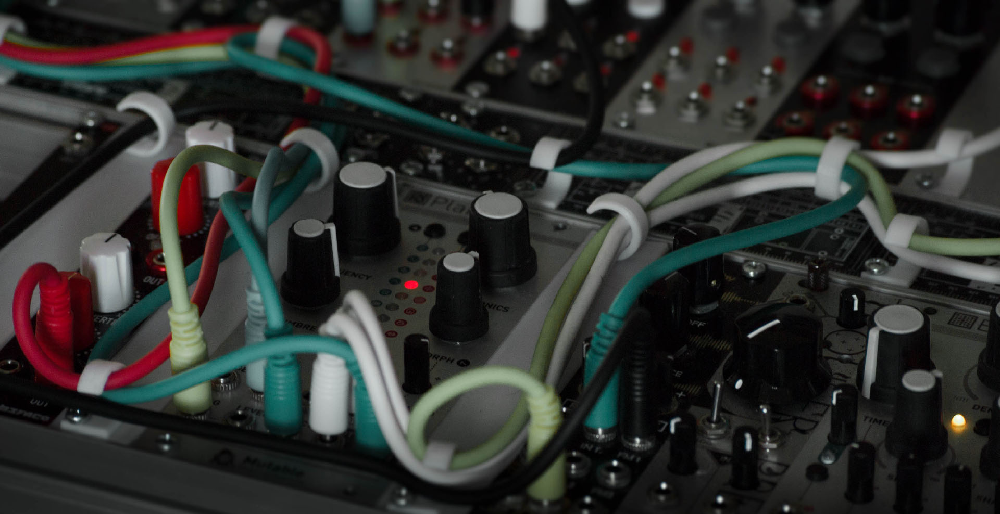

# Eurorack Cable Clips

 A simple cable clip for Eurorack
The design is made for 3D printing, and has zero overhangs, so can be very easily printed on any standard machine with no need for support material. They are 2mm thick at the point where they are screwed on, so you will need screws that are at least long enough to go through both this 2mm and the panel its being screwed onto (most standard M3 screws will anyway)

